Are you a hall administrator in-charge of managing residents in NUS? Do you have to fumble through multiple different excel sheets just to look for a resident's information? Are you worried residents might be subject to the dangers of the pandemic? Well look no further as SafeFor(H)All is the application you need!

SafeFor(H)All is a **desktop app for hall admins to keep track of hall residents’ information to keep hall residents safe during the COVID-19 pandemic via a Command Line Interface (CLI)** while still having the benefits of a Graphical User Interface (GUI). If you can type fast, SafeFor(H)All can get your hall management tasks done faster than traditional GUI apps.

* Table of Contents
{:toc}

--------------------------------------------------------------------------------------------------------------------

## Quick start

1. Ensure you have Java `11` or above installed in your Computer.

1. Download the latest `safeforhall.jar` from [here](https://github.com/AY2122S1-CS2103T-T15-4/tp/releases/tag/v1.3.trial).

1. Copy the file to the folder you want to use as the _home folder_ for your SafeFor(H)All Application.

1. Double-click the file to start the app. The GUI similar to the below should appear in a few seconds.   
   

1. Type the command in the command box and press Enter to execute it. e.g. typing **`help`** and pressing Enter will open the help window. 
   Some example commands you can try:

   * **`view`** : Lists all residents.

   * **`add`**`n/John Doe r/A100 e/john@gmail.com p/12345678 v/t f/SoC` : Adds a resident named `John Doe` with the given information to the application.

   * **`delete`**`3` : Deletes the 3rd resident shown in the current list.

   * **`exit`** : Exits the app.

1. Refer to the [Features](#features) below for details of each command.

-------------------------------------------------------------------------------------------------------------
## App Interface

Refer to the diagram below to understand how our app, SafeFor(H)All looks like.

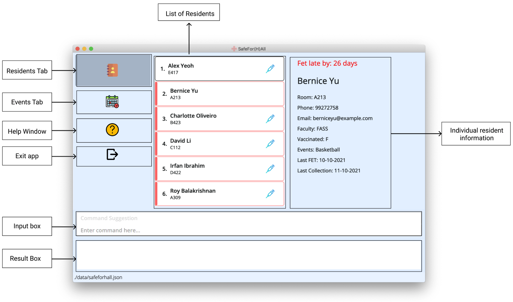

Section | Explanation
|--------|-------
**Residents Tab** | When selected, it allows you to view the list of residents and their associated information
**Events Tab** | When selected, it allows you to view the list of events and their associated information
**Help Window** | When clicked, a pop-up will appear containing a list of commands and how to use them
**Exit app** | Closes the app
**Input Box** | Input your command here. The command suggestion box will suggest parameters upon typing
**Result Box** | The result of the inputted command will be displayed here
**List of Residents** | Displays the list of residents in the app. You can view details about a specific resident by clicking on it, or by using the `view` command
**Individual resident information** | In the example shown, the resident has a late FET test which is 21 days overdue.

## Legend

Below are some formats used to convey different kinds of information:

| Syntax              | Description                                         |
| ------------------- | --------------------------------------------------- |
| 
 :information_source: Information Boxes
 | These contain additional information about SafeFor(H)All.      |
| 
 :bulb: Tips
  | These contain our tips that can help improve your experience using SafeFor(H)All. |
| 
 :warning: Warnings
 | These contain warnings that can result in unintended consequences of a feature.    |
| `Highlights` | These are used to highlight parameters, field values, commands, file names or any user inputs. |

### Command Format

**Format:** `COMMAND_WORD PREFIX/PARAMETER`

| Format              | Description                                         |
| ------------------- | --------------------------------------------------- |
| `COMMAND_WORD`      | A word at the start of the command to specify the action to be done.   e.g. in `add n/NAME`, `add` is the command word.                             |
| `PARAMETER`         | The information to be supplied by the user.  e.g. in `add n/NAME`, `NAME` is a parameter which can be used as `add n/John Doe`   |
| `PREFIX` | One or two alphabets followed by a `/`, to be inputted before every `PARAMETER` to denote the type of information being supplied as parameter.  e.g. in `add n/NAME`, `n/` is a prefix to indicate that NAME is being supplied.   |

| Types of Parameters    | Description                                         |
| ------------------- | --------------------------------------------------- |
| `[PARAMETER]`      |  Items in square brackets are optional. e.g `add n/NAME [fd/LAST_FET_DATE]` can be used as `add n/John` or as `add n/John fd/09-09-2021`.                        |
| `PARAMETER...`     | An ellipsis (...) implies multiple of that parameter can be provided. e.g `edit INDEX...` can be used as `edit 1` or as `edit 1 2 3 5 8`. |
| `DATE` | Date parameters can be of formats: `dd-mm-yyyy`, `dd.mm.yyyy` or `dd/mm/yyyy`  |
| `TIME`  | Time parameter is of format: `hhmm` |

**:information_source: Additional Information** 

* Parameters can be in any order. 
  e.g. if the command specifies `n/NAME f/FACULTY`, `f/FACULTY n/NAME` is also acceptable.

* If a parameter is expected only once in the command but you specified it multiple times, only the **last occurrence** of the parameter will be taken. 
  e.g. if you specify `v/t v/f` only `v/f` will be taken.

* Extraneous parameters for commands that do not take in parameters (such as `help`, `exit`, `view`) will be ignored. 
  e.g. if the command specifies `help 123`, it will be interpreted as `help`.
  

## Features

### For Residents

These commands will function as specified when run under the `Resident` tab.

#### Adding a resident’s information : `add`

Adds a resident and their information to the application.

Format: `add n/NAME p/PHONE_NUMBER e/EMAIL r/ROOM v/VACCINATION_STATUS f/FACULTY [fd/LAST_FET_DATE] [cd/LAST_COLLECTION_DATE]`

Parameter | Constraints
|--------|-------
**NAME** | Unique, only containing alphabetical characters and spaces
**PHONE** | At least 6 digits long
**ROOM** | Unique, made up of **block** + **level** + **number**  **block** is an alphabetical character from A to E  **level** is a digit from 1 to 4  **number** is two digits from 00 to 29  e.g. `A100`
**EMAIL** |  The local-part should only contain alphanumeric characters.   This is followed by a '@' and then a domain name.
**VACCINATION_STATUS** | `T` or `F` (case insensitive)
**FACULTY** | Single alphabetical word
**LAST_FET_DATE**   **LAST_COLLECTION_DATE** | Should be of `dd-mm-yyyy`, `dd.mm.yyyy` or `dd/mm/yyyy` format

**:information_source: Note:** 

**ROOM** is currently modelled after an existing hall in the National University of Singapore.

:bulb: **Tip:**
`LAST_FET_DATE` and `LAST_COLLECTION_DATE` are optional parameters.

Here's a step by step guide: 
1. Type the `add` command and the rest of the parameters with help from the command suggestion.
   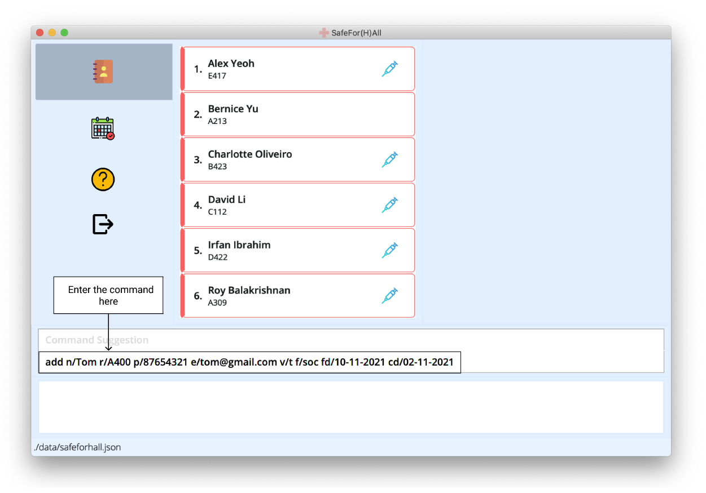

2. After execution, the person list will now show the new person.
   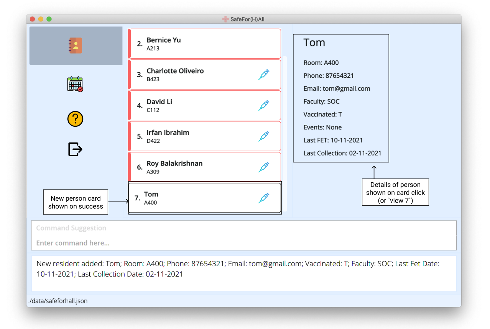

Examples:
* `add n/John Doe p/98765432 e/johnd@example.com r/A100 v/t f/SoC`
* `add n/Betsy Crowe e/betsyc@example.com v/F r/B400 p/1234567 f/FASS fd/20-10-2021 cd/23-10-2021`

#### Viewing residents information : `view`

Shows a numbered list of all the residents in the address book.

The index of the resident is the corresponding number in the list
shown when `view` (without the [INDEX] parameter) is called.

Format: `view [INDEX]`
* For an index i, 1 ≤ i ≤ n, where n is the number of residents in the address book

Examples:

* `view` shows a list of all the residents
* `view 30` shows the details of the resident at index 30

#### Listing residents by fet/collection deadlines : `deadline`

Lists residents whose ART collection or FET tests are either:
* due before a given date, `d1`, by using the `late keywords` or 
* due within the range of two given dates, `d1` and `d2`, by using the `normal keywords`.

**:information_source: Note:** 

* There is a one week deadline for the test kit collection and fet test, therefore due date refers to one week after the last recorded date

| Differences | Normal Keyword | Late Keyword |
|-------------|--------|------|
| Format | `deadline k/KEYWORD d1/DATE1 d2/DATE2` | `deadline k/LATE_KEYWORD d1/DATE1`|
| Keyword | `f` or `c` | `lf` or `lc` |
| Input Date | Both `DATE1` and `DATE2` have to be inputted | Only `DATE1` should be inputted |
| Command Example | `deadline k/f d1/10-10-2021 d2/12-10-2021` | `deadline k/lf d1/11-10-2021` |
| Usage | List residents whose deadline lie within the range of two given dates, inclusive | List residents whose deadline is due before a given date
| Usage Example | A resident's fet or collection is due one week after their `last fet date` or `last collection date`.   For example, if a resident's last fet date is on a friday, `15-10-2021`, then the resident's fet deadline is on the following friday which is `22-10-2021` | The number of days a resident is considered late is calculated from `a day after` their deadline to the `current date`, both inclusive.  For example, if a resident's last fet date is `15-10-2021`, then the fet deadline will be `22-10-2021`, if the current date is `25-10-2021`, then the number of days the resident is late for fet is `3 days`.
| Note | The given `DATE2` must be a date later than the given `DATE1` `DATE1` is the start date and `DATE2` is the last date inclusive | Anyone whose fet and collection is due before but not on `DATE1` is outputted

Here's a step-by-step guide for `Normal Keyword`: 
1. Type the `deadline` command with the `normal keyword`, `f` for fet or `c` for collection, `d1`, the start date and
   `d2`, the end date.
   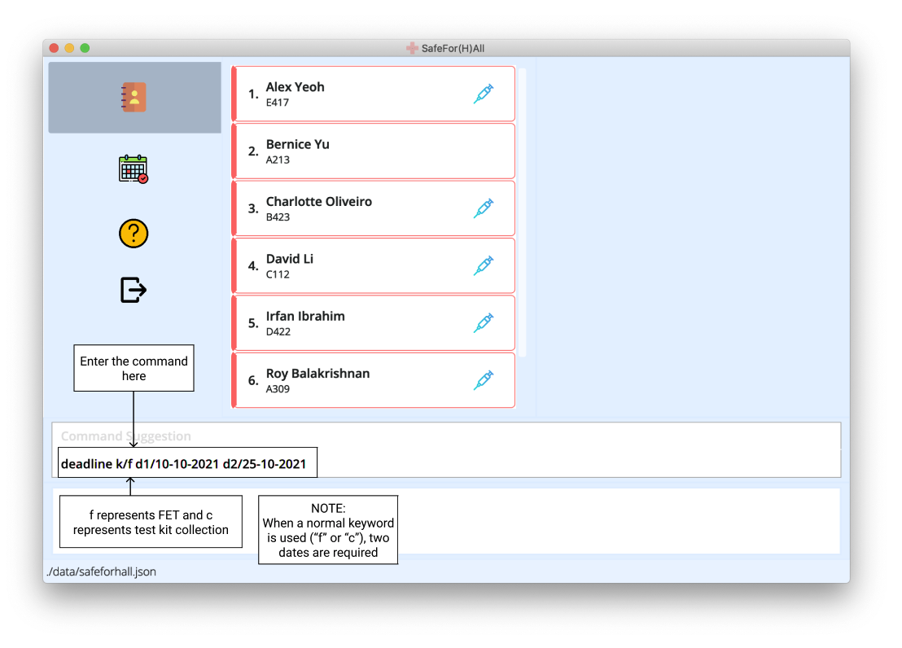

2. The event list will now show the filtered list of residents.
   

Here's a step-by-step guide for `Late Keyword`: 
1. Type the `deadline` command with the `late keyword`, `lf` for late fet or `lc` for late collection, `d1`, the 
   end date
   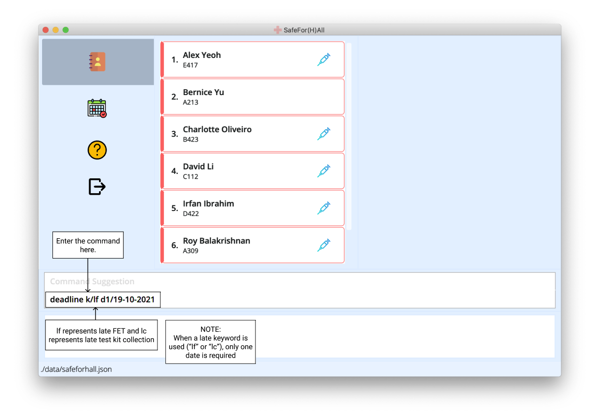

2. The event list will now show the filtered list of residents.
   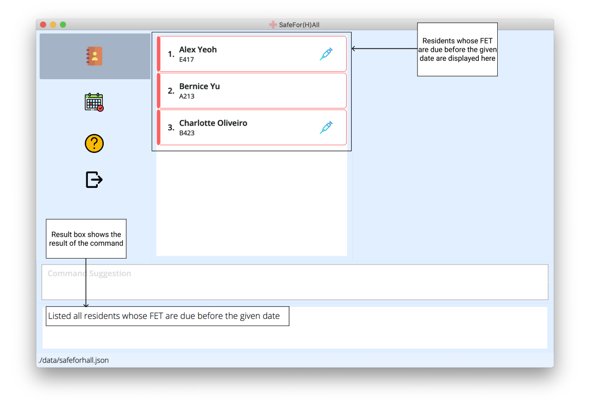
   

Examples:
* `deadline k/f d1/10-10-2021 d2/12-10-2021` retrieves a list of residents whose `FET` is due between `10 Oct 2021` and `12 Oct 2021`, inclusive
* `deadline k/f d1/15-10-2021 d2/20-10-2021` retrieves a list of residents whose `Test Kit Collection` is due some day between `15 Oct 2021` and `20 Oct 2021`, inclusive
* `deadline k/lf d1/11-10-2021` retrieves a list of residents whose `FET` is due before `11 Oct 2021`
* `deadline k/lc d1/12-10-2021` retrieves a list of residents whose `Test Kit Collection` is due before `12 Oct 2021`

#### Searching by resident information: `find`

Shows a list of residents that match the provided keywords for different available parameters. Allowed flags include; `n/`, `r/`, `e/`, `p/`, `f/` and `v/`.

Format: `find [PREFIX/KEYWORD]...`

Prefix | Field | Restrictions
-------- | ------ | ------
`n` | Name | - It is case-insensitive. e.g `hans` will match `Hans`, `True` will match `true`     - The order of the keywords provided for the name does not matter. e.g `Hans Bo` will match `Bo Hans`     - Only full words will be matched. e.g `Han` will not match `Hans`     - Residents matching at least one keyword for the name will be returned (i.e. `OR` search). e.g `Hans Bo` will return `Hans Gruber`, `Bo Yang`
`r` | Room |  - It is case-insensitive   - A block can be used as a search. e.g `r/A`   - A level can be used as a search. e.g `r/2`   - A block-level can be used as a search. e.g `r/A2`   - A full valid room can be used as a search. e.g `r/A210`
`e`, `p`, `f`, `v` | Email, Phone,   Faculty, VaccStatus | Subject to the same validity conditions as in the [Add Command](#adding-a-residents-information--add)   

**:information_source: Note:** 

* Prefixes for `LAST_FET_DATE` and `LAST_COLLECTION_DATE` are not used. Refer to [Deadline Command](#listing-residents-by-fetcollection-deadlines--deadline) on how to make use of these fields.
* Any provided preamble to the prefixes will be ignored

Examples:
* `find n/John` returns `john` and `John Doe`
* `find n/alex david v/t` returns vaccinated residents, `Alex Yeoh` and `David Li`
* `find v/f f/soc` returns un-vaccinated residents from SoC  

#### Editing a resident : `edit`

Edits the details of existing residents in the address book.

Format: `edit INDEX… [n/NAME] [r/ROOM] [p/PHONE] [e/EMAIL] [v/VACCINATION_STATUS] [f/FACULTY] [fd/LAST_FET_DATE] [cd/LAST_COLLECTION_DATE]`

Parameter | Constraints
|--------|-------
**NAME** | Unique, only containing alphabetical characters and spaces
**PHONE** | At least 6 digits long
**ROOM** | Made up of **block** + **level** + **number**  **block** is an alphabetical character from A to E  **level** is a digit from 1 to 4  **number** is two digits from 00 to 29  e.g. `A100`
**EMAIL** |  The local-part should only contain alphanumeric characters and these special characters, excluding the parentheses, (+_.-). The local-part may not start or end with any special characters.   This is followed by a '@' and then a domain name. The domain name is made up of domain labels separated by periods.   The domain name must:   - end with a domain label at least 2 characters long   - have each domain label start and end with alphanumeric characters   - have each domain label consist of alphanumeric characters, separated only by hyphens, if any.
**VACCINATION_STATUS** | `T` or `F` (case insensitive)
**FACULTY** | Single alphabetical word
**LAST_FET_DATE**   **LAST_COLLECTION_DATE** | Should be of `dd-mm-yyyy`, `dd.mm.yyyy` or `dd/mm/yyyy` format

* Edit the residents at the specified `INDEXES`.
* Each index refers to the index number shown in the displayed resident list.
* The indexes **must be positive integers** 1, 2, 3, …​
* At least one of the optional fields must be provided.
* Existing values will be updated to the input values.
* Edit multiple residents in a single command by inputting multiple indexes, each separated by a space.

Example: 
Let’s say that residents Alex Yeoh and Bernice Yu just updated you that they are now fully vaccinated, and have submitted their overdue FET on 5th Nov 2021.

You can easily update these details in a single `edit` command. 

1. Navigate to the list of residents. Note that Alex Yeoh and Bernice Yu have indexes of 1 and 2 respectively in the current resident list. 
   To update Alex and Bernice's vaccination statuses and last FET dates, simply enter `edit 1 2 v/T fd/05-11-2021`.
   
   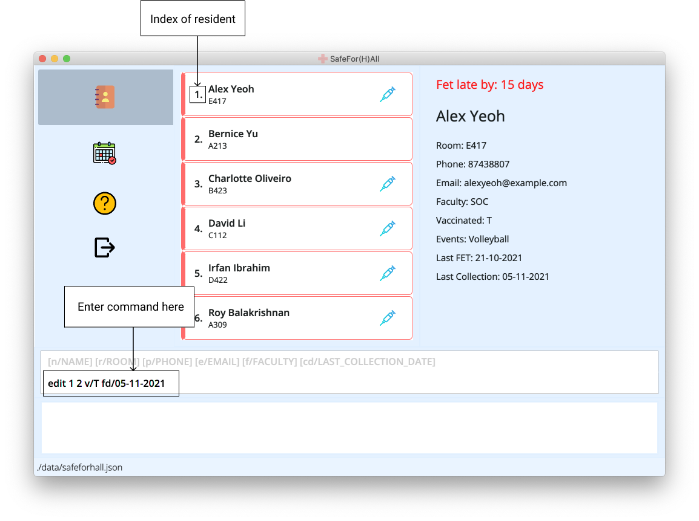

2. The result box will notify you of the edited residents. The resident list will be updated to contain the modified details.
   Note that in this case, Alex Yeoh and Bernice Yu no longer have outstanding FETs to submit, so the red flag around their name will be removed.
   There will also be a syringe symbol beside their names to show that they are vaccinated.
   
   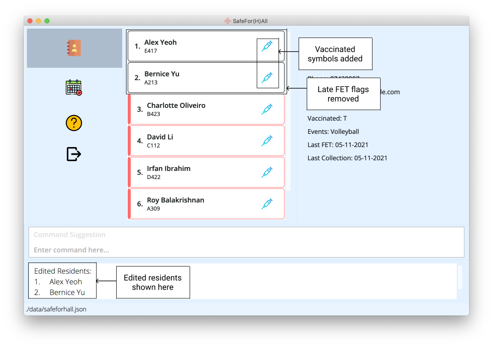
   
   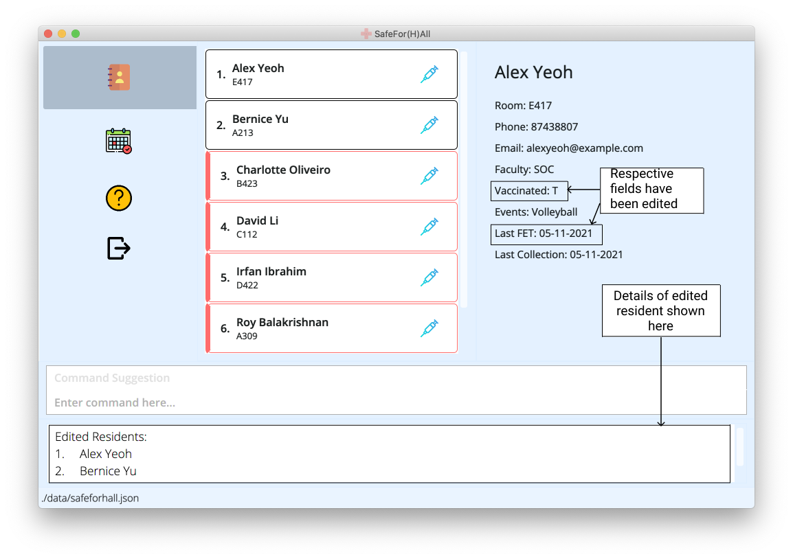
   
More Examples:
*  `edit 1 e/johndoe@example.com r/A101` Edits the email address and room number of the 1st resident to be `johndoe@example.com` and `A101` respectively.
*  `edit 1 2 3 v/t fd/20-10-2021` Sets the vaccination status of the 1st, 2nd, and 3rd resident as vaccinated, and sets their last FET dates to 20-10-2021.

#### Deleting a resident : `delete`

 :warning: **Warning:** The `delete` command cannot be undone! Do make sure that you have entered the command correctly before running it.

Deletes specified residents from the address book.

Format: `delete INDEX…`

* Delete the residents at the specified `INDEXES`.
* Each index refers to the index number shown in the displayed resident list.
* The indexes **must be positive integers** 1, 2, 3, …​
* Delete multiple residents in a single command by inputting multiple indexes, each separated by a space.

Example: 
Suppose Alex Yeoh and Bernice Yu have recently moved out of hall. To keep the addressbook updated, you might want to remove them from the list of residents.

You can easily do this a single `delete` command. 

1. Note that Alex Yeoh and Bernice Yu have indexes of 1 and 2 respectively in the current resident list. To remove them from the list of residents, simply enter `delete 1 2`.
   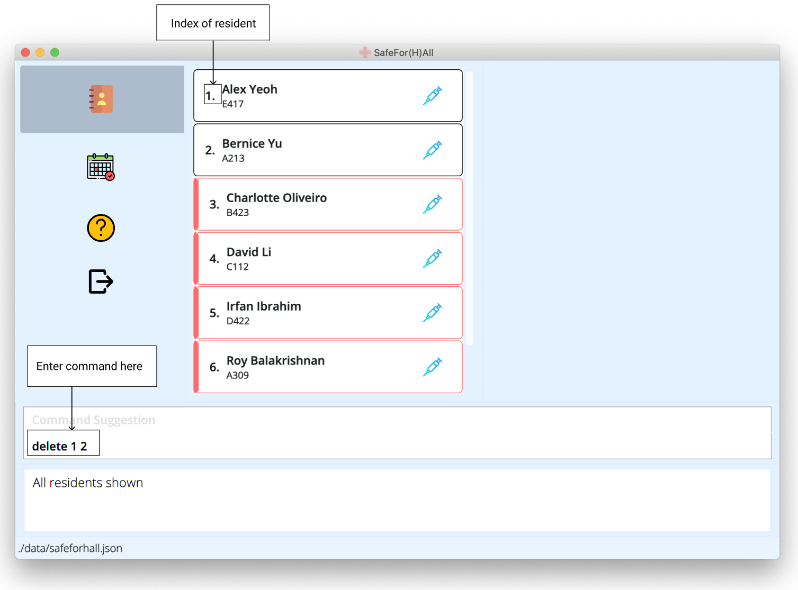

3. The result box will notify you of the deleted residents. Alex Yeoh and Bernice Yu will also be removed from the resident list.
   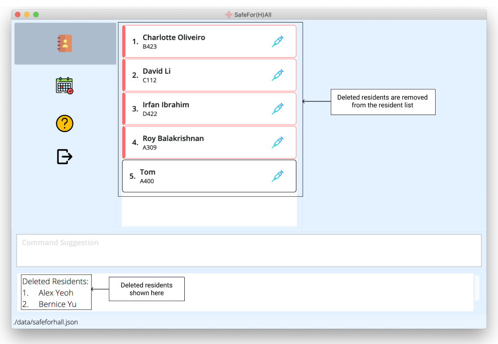

More Examples:
* `view` followed by `delete 1 2 3` deletes the first 3 residents in the address book.
* `find n/Anne` followed by `delete 1` deletes the 1st resident named Anne in the results of the `find` command.

#### Tracing close contacts : `trace`

Traces a resident's close contacts based on the events they're involved in. This is useful when a COVID case is located within the residence and their close contacts are to be notified of proper procedure to follow.

Format: `trace r/RESIDENT [d/DEPTH] [t/DURATION]`

Prefix | Field | Details
-------- | ------ | ------
`r` | Resident | The resident to trace can be identified either by full name or room (case-insensitive)
`d` | Depth | Refers to the maximum allowed links to reach the resident in question   It is an integer, 1 <= depth <= 5, and will default to 1 if not specified
`t` | Duration | Represents the time in days to trace back to.   It is an integer, 1 <= duration <= 31, and will default to 7 if not specified

1. Using sample data, running `trace r/Alex Yeoh d/1` will trace down residents Charlotte and David since they all were in the Volleyball event.
   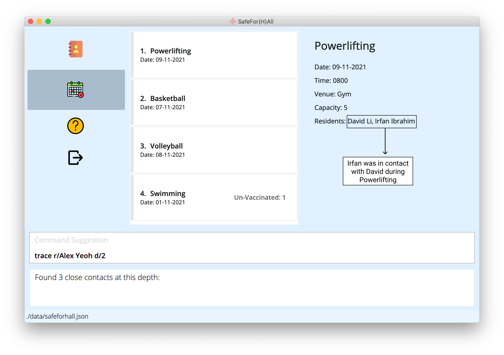

2. Using sample data, running the above command but with depth 2, `trace r/Alex Yeoh d/2`,will trace down resident Irfan in addition, since David in turn was in contact with Irfan during Powerlifting event.
   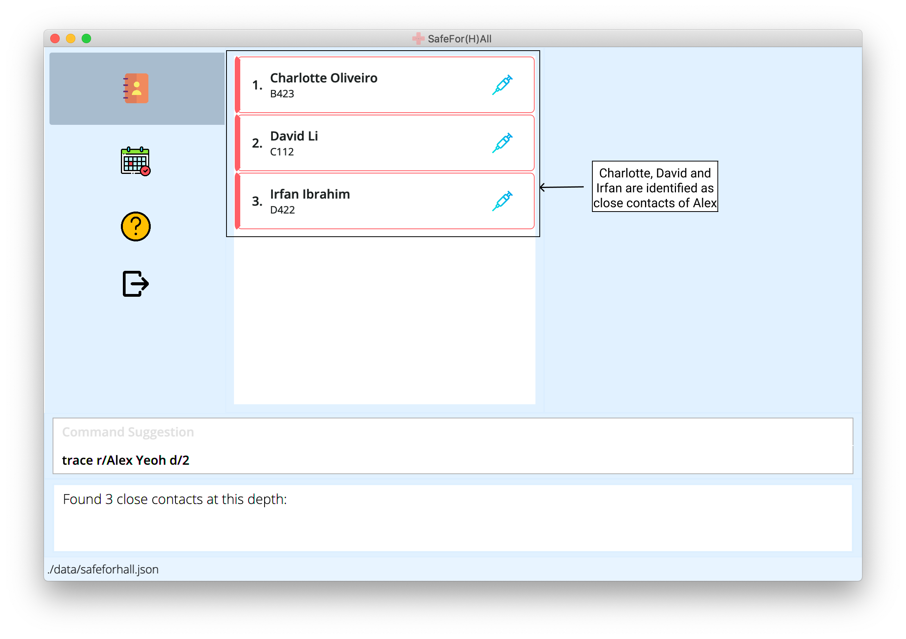

:warning: **Note:** The above commands will, given time, not result in any close contacts since this is a time-dependent problem. The examples are used to merely explain the concept of depth.

Examples:
* `trace` followed by `r/A101` lists the resident's immediate close contact from events in the past 7 days.
* `trace r/Anne` followed by `d/2 t/4` lists Anne's immediate contacts and their immediate contacts from events in the past 4 days.

#### Sorting residents : `sort`

 :bulb: **Tip:** To undo the `sort` command, simply run `view`.

Sorts the residents according to specified fields in ascending or descending order

Format: `sort by/FIELD o/ORDER`

FIELD | Resident's field
-------- | ------ 
`n` | Name
`e` | Email
`r` | Room
`p` | Phone
`f` | Faculty
`v` | Vaccination
`fd` | FET date
`cd` | Collection date

* `ORDER` can be `a` for ascending or `d` for descending

Examples:
* `sort by/n o/a` sorts the residents by name in ascending order

#### Importing resident data : `import`

Imports resident information from the specified csv file which is to be located within the `data/` folder.

Format: `import CSV_NAME`

**:information_source: Note:** 

* 8 comma separated values for each row with values in order;  
  `name`, `room`, `phone`, `email`, `vaccStatus`, `faculty`, `lastFetDate`, `lastCollectionDate`
* The first row will be discarded as column headings
* `lastFetDate`, `lastCollectionDate` are optional (can be left as empty space)
* The file format (`.csv`) is not to be included in `CSV_NAME`

:bulb: **Tip:**
You can save to `csv` format from an excel file by  Save as` -> `.csv`

:warning: **Warning:** Resident lists of all events will be cleared!

Here's a step by step guide: 

1. Create your csv file in the correct format (shown below).
    

2. Place your csv file in the `data/` folder.
    

3. Run `import CSV_NAME`.
    

Examples:
* `import` followed by `safeforhall` attempts to read the file `safeforhall.csv` within the `data/` folder.

#### Exporting residents' emails : `export`

Exports the emails of all the residents in the last filtered list to a csv file within the `data/exports/` folder.
A quick copy-paste of the email addresses from the csv file allows you to send mass emails using modern email clients.

Format: `export FILE_NAME`

**:information_source: Note:** 

* The file format (`.csv`) is not to be included in the `FILE_NAME`

1. Run `export FILE_NAME`.
   

2. Find your csv file in the `data/exports` folder.
   

3. Your exported csv file should look like this.
   

Examples:
* `export` followed by `safeforhall` creates a `safeforhall.csv` within the `data/exports/` folder, with the emails of all the residents currently displayed on the application.

### For Events

These commands will function as specified when run under the `Event` tab.

#### Adding an event : `add`

Adds a new event to the address book.

Format: `add n/EVENT_NAME v/VENUE c/CAPACITY d/DATE t/TIME [r/RESIDENTS]`

Prefix | Field | Details
-------- | ------ | ------
`n` | Name | Should only contain alphanumeric characters and spaces, and it should not be blank
`v` | Venue | Should only contain alphanumeric characters and spaces, and it should not be blank
`c` | Capacity | Represents the maximum number of residents allowed in this event and is an integer, 1 <= capacity <= 2147483647
`d` | Date | Should be of `dd-mm-yyyy`, `dd.mm.yyyy` or `dd/mm/yyyy` format
`t` | Time | Should be of `HHmm` format
`r` | Residents | Can be identified with either all names or all rooms   The number of residents cannot exceed the provided capacity   Provided names and rooms are case-insensitive and should be comma-separated

**:information_source: Note:** 

* The combination of `Name` (case-insensitive), `Venue` (case-insensitive), `Date` and `Time` should be unique

Here's a step by step guide: 
1. Type the `add` command and the rest of the parameters with help from the command suggestion.
   

2. After execution, the event list will now show the new event.
   

Examples:
* `add n/Swim v/Swimming Pool c/10 d/28-10-2021 t/1500`
* `add n/Frisbee v/MPSH c/15 d/30/10/2021 t/1500 r/E201`  
* `add n/Frisbee v/MPSH c/15 d/30/10/2021 t/1500 r/E201, a121`
* `add n/Frisbee v/MPSH c/15 d/30/10/2021 t/1500 r/John Doe, Jane Doe`

#### Viewing events information : `view`

Shows a numbered list of all the events in the address book.

The index of the event is the corresponding number in the list
shown when `view` (without the [INDEX] parameter) is called.

Format: `view [INDEX]`
* For an index i, 1 ≤ i ≤ n, where n is the number of events in the address book

Examples:

* `view` shows a list of all the events
* `view 5` shows the details of the event at index 5

#### Editing an event : `edit`

Edits an existing event in the address book.

Format: `edit INDEX [n/EVENT_NAME] [v/VENUE] [c/CAPACITY] [d/EVENT_DATE] [t/EVENT_TIME]`

Prefix | Field | Details
-------- | ------ | ------
`n` | Name | Should only contain alphanumeric characters and spaces, and it should not be blank
`v` | Venue | Should only contain alphanumeric characters and spaces, and it should not be blank
`c` | Capacity | Represents the maximum number of residents allowed in this event and is an integer, 1 <= capacity <= 2147483647
`d` | Date | Should be of `dd-mm-yyyy`, `dd.mm.yyyy` or `dd/mm/yyyy` format
`t` | Time | Should be of `HHmm` format

* Edits the event at the specified `INDEX`.
* The index refers to the index number shown in the displayed event list.
* The index **must be a positive integer** 1, 2, 3, …​
* At least one of the optional fields must be provided.
* Existing values will be updated to the input values.

Example: 
Let’s say that Powerlifting changed the date and time of their event from `25 Oct 2021 8:00AM` to `26 Oct 2021 9:00AM`.

You can easily update these details in a single `edit` command. 

1. Note that Powerlifting's index is reflected as 1 in the current list of events. To update the date and time of the event, simply enter `edit 1 d/26-10-2021 t/0900`.
   

2. The result box will display the updated details of the event. The event list will also be updated to contain the modified event details.
   

More Examples:
*  `edit 1 n/Football Training v/Field c/50` Edits the name, venue, and capacity of the 1st event in the event list to be `Football Training`, `Field`, and `50` respectively.

#### Searching by event information: `find`

Shows a list of events that match the provided keywords for different available parameters. Allowed flags include; `n/`, `d/`, `v/`, `c/`

Format: `find [PREFIX/KEYWORD]...`

Prefix | Field | Restrictions
-------- | ------ | ------
`n` | Name | - It is case-insensitive. e.g `dance` will match `Dance`     - Keywords will be matched without the need to enter the full event name. e.g `Band` will match `Band training`     - Events matching at least one keyword for the event name will be returned (i.e. `OR` search). e.g `Football Basketball` will return `Football Training`, `Basketball Training`
`v` | Venue | - It is case-insensitive. e.g `nus field` will match `NUS Field`     - Only full event names will be matched. e.g `Field` will not match `NUS Field`
`d, c` | Date, Capacity | - Subject to the same validity conditions as in the [Add Event Command](#adding-an-event--add)

Examples:
* `find n/Football` returns `Football Match` and `Football Training`
* `find v/NUS field c/5` returns all the events at `NUS field` which have a capacity of `5`
* `find d/03-01-2021` returns all the events which occur on the date `03-01-2021`  

#### Deleting an event : `delete`

 :warning: **Warning:** The `delete` command cannot be undone! Do make sure that you have entered the command correctly before running it.

Deletes specified events from the address book.

Format: `delete INDEX…`

* Delete the events at the specified `INDEX…`.
* Each index refers to the index number shown in the displayed event list.
* The indexes **must be positive integers** 1, 2, 3, …​
* Delete multiple events in a single command by inputting multiple indexes, each separated by a space.

Example: 
Suppose Football Training is cancelled due to a tightening of COVID-19 measures. To keep the addressbook updated, you might want to remove the event from the list of events.

You can easily do this a single `delete` command. 

1. Note that the event "Football Training" has an index of 2 in the current event list. To remove it from the list of events, simply enter `delete 2`.
   

2. The result box will notify you of the deleted event. The event will also be removed from the event list.
   
   
More Examples:
* `view` followed by `delete 1 2 3` deletes the first 3 events in the address book.
* `find n/Football Training` followed by `delete 1` deletes the 1st event named Football Training in the results of the `find` command.

#### Add residents to an event: `include`

Add multiple residents to an event based on the information given(name or room number), a resident is only expected to be given a name or a room.

Format: `include INDEX r/RESIDENTS`

**:information_source: Note:** 

* Residents can be given in the form of `names/rooms`, but all has to be all `rooms` or all `names`
* The residents' `names/rooms` inputted have to exist in the address book under the `Resident` Tab to be added to an `Event`
* When adding multiple `names/rooms`, each resident's `name/room` is separated by a comma
* The resident's `name/room` inputted is case-insensitive

Here's a step-by-step guide: 
1. Type the `include` command with the `index` of the event, and the `names/rooms` of the residents to include to
   the event. When adding multiple `names/rooms`, remember to separate the `names/rooms` by a comma.
   

2. The sidebar will now show the updated list of residents in the event.
   
   

Examples:
* `include 1 r/A101` adds the resident who stays in room A101 to the first event in the address book
* `include 2 r/A101, A102, A103` adds the residents who stay in rooms A101, A102 and A103 to the second event in the address book
* `include 3 r/John Doe` adds John Doe to the third event in the address book
* `include 4 r/John Doe, Jane Doe` adds John Doe and Jane Doe to the fourth event in the address book

#### Remove residents from an event: `exclude`

Remove multiple residents from an event based on the information given(name or room number), a resident is only expected to be given a name or a room.

Format: `exclude INDEX r/RESIDENTS`

**:information_source: Note:** 

* Residents can be given in the form of `names/rooms`, but all has to be all `rooms` or all `names`
* The residents' `names/rooms` inputted have to be involved in the `Event` under the `Event` Tab, to be removed from
  that event
* When removing multiple `names/rooms`, each resident's `name/room` is separated by a comma
* The resident's `name/room` inputted is case-insensitive

Here's a step-by-step guide: 
1. Type the `exclude` command with the `index` of the event, and the `names/rooms` of the residents to exclude from
   the event. When removing multiple `names/rooms`, remember to separate the `names/rooms` by a comma.
   

2. The sidebar will now show the updated list of residents in the event.
   

Examples:
* `exclude 1 r/A101` removes the resident who stays in room A101 from the first event in the address book
* `exclude 2 r/A101, A102, A103` removes the residents who stay in rooms A101, A102 and A103 from the second event in the address book
* `exclude 3 r/John Doe` removes John Doe from the third event in the address book
* `exclude 4 r/John Doe, Jane Doe` removes John Doe and Jane Doe from the fourth event in the address book

#### Sorting events : `sort`

 :bulb: **Tip:** To undo the `sort` command, simply run `view`.

Sorts the events according to specified fields in ascending or descending order.

Format: `sort by/FIELD o/ORDER`

FIELD | Event's field
-------- | ------ 
`n` | Name
`d` | Date and Time
`c` | Capacity
`v` | Venue

* `ORDER` can be `a` for ascending or `d` for descending

Examples:
* `sort by/n o/a` sorts the events by name in ascending order
* `sort by/d o/a` sorts the events by date and time from old to new
* `sort by/d o/d` sorts the events by date and time from new to old

### Commons

These commands will function the same in either tab.

#### Viewing help : `help`

Provides a short summary of the commands and a hyperlink for the user to reach this online user guide.

Format: `help`

#### Switching tabs: `switch`

Toggles between the `Residents` and `Events` tab.

Format: `switch`

#### Command history

The `up` and `down` arrow keys when used with the input box in focus, allows traversal of past input commands to increase of use and efficiency.

#### Command suggestion

A suggested string of parameters is displayed above the input box when a valid command is entered, parameters that have their prefixes entered correctly are removed from this suggestion.

#### Clearing all entries : `clear`

Clears all entries from the address book, including entries from the `Resident` Tab and the `Event` Tab. Data cleared cannot be retrieved and this command should be used with caution. A sample data can be retrieved by removing the `safeforhall.json` file from `/data`

Format: `clear`

#### Exiting the program : `exit`

Exits the program.

Format: `exit`

-------------------------------------------------------------------------------------------------------------

## Prefix summary

### Resident Prefix

PREFIX | Description | Usage
|-------- | ------ | ------
`n/` | Name | `add`, `edit`, `find`
`p/` | Phone number | `add`, `edit`, `find`
`e/` | Email address | `add`, `edit`, `find`
`r/` | Room | `add`, `edit`, `find`
`v/` | Vaccination status | `add`, `edit`, `find`
`f/` | Faculty | `add`, `edit`, `find`
`fd/` | Last FET date | `add`, `edit`
`cd/` | Last collection date | `add`, `edit`
`k/` | Keyword | `deadline`
`d1/` | Date 1 | `deadline`
`d2/` | Date 2 | `deadline`
`r/` | Resident | `trace`
`d/` | Depth | `trace`
`t/` | Duration | `trace`
`by/` | Field | `sort`
`o/` | Order | `sort`

### Event Prefix

PREFIX | Description | Usage
|-------- | ------ | ------
`n/` | Name | `add`, `edit`
`v/` | Venue | `add`, `edit`
`c/` | Capacity | `add`, `edit`
`d/` | Date | `add`, `edit`
`t/` | Time | `add`, `edit`
`r/` | Residents | `add`, `include`, `exclude`
`by/` | Field | `sort`
`o/` | Order | `sort`

## Command summary

### Resident Commands

Command | Format | Examples
|--------|-------|----------
**Add** |  `add n/NAME p/PHONE_NUMBER e/EMAIL r/ROOM v/VACCINATION_STATUS f/FACULTY [fd/LAST_FET_DATE] [cd/LAST_COLLECTION_DATE]` | `add n/Betsy Crowe e/betsyc@example.com v/F r/B400 p/1234567 f/FASS fd/20-10-2021 cd/23-10-2021`
**View** | `view [INDEX]`| `view 30`
**Deadline** | `deadline k/KEYWORD d1/DATE1 d2/DATE` or `deadline k/LATE_KEYWORD d1/DATE1` | `deadline k/f d1/15-08-2021 d2/20-08-2021` or `deadline k/lf d1/15-08-2021`
**Find** | `find [PREFIX/KEYWORD]...` | `find n/john alex v/false f/fass`  
**Edit** | `edit INDEX… [FLAG/UPDATED_PARTICULARS]…` | `edit 1 2 3 v/true fd/20-10-2021`  
**Delete** | `delete INDEX…` | `delete 1 2 3`
**Trace** | `trace r/RESIDENT [d/DEPTH] [t/DURATION]` | `trace r/D201 d/2 t/4`
**Sort** | `sort by/FIELD o/ORDER` | `sort by/n o/a`
**Import** | `import CSV_NAME` | `import safeforhall`
**Export** | `export FILE_NAME` | `export closeContactsOfA123`

### Event Commands

Command | Format | Examples
|--------|-------|----------
**Add** |  `add n/EVENT_NAME v/VENUE c/CAPACITY d/DATE t/TIME [r/RESIDENTS]` | `add n/Frisbee v/MPSH c/15 d/30/10/2021 t/1500 r/E201`
**View** | `view [INDEX]`| `view 30`
**Find** | `find [PREFIX/KEYWORD]...` | `find n/Swim d/28-10-2021`
**Edit** | `edit INDEX [FLAG/UPDATED_PARTICULARS]…` | `edit 1 n/Football Training l/Field`
**Delete** | `delete INDEX…` | `delete 1 2 3`
**Include** | `include INDEX r/RESIDENTS` | `include 1 r/A102, E416`
**Exclude** | `exclude INDEX r/RESIDENTS` | `exclude 1 r/A102, E416`
**Sort** | `sort by/FIELD o/ORDER` | `sort by/c o/d`

### Commons

Command | Format
|--------|-------
**Help** | `help`
**Switch** | `switch`
**Clear** | `clear`
**Exit** | `exit`

